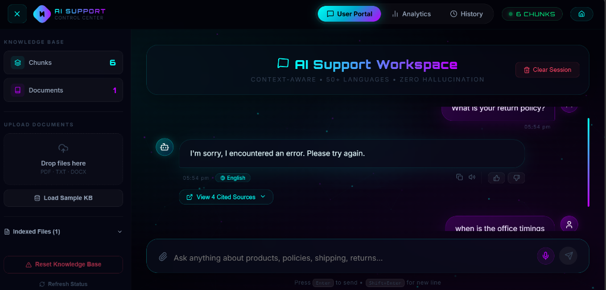

# 🤖 Intelligent Customer Support Chatbot

A production-ready **Generative AI** customer support chatbot powered by **RAG (Retrieval-Augmented Generation)**, **OpenAI GPT-4o** (or Anthropic Claude), **ChromaDB**, and **Streamlit**.

> Built as an AI & Data Science mini project — suitable for live demonstration.

---

## ✨ Features

| Feature | Details |
|---------|---------|
| 📄 **Knowledge Base** | Upload PDF, DOCX, TXT files as company documents |
| 🔍 **RAG Pipeline** | Answers grounded in your documents — zero hallucination |
| 🌐 **Multilingual** | Auto-detects & replies in English, Tamil, Hindi + 50 more languages |
| 💬 **Chat Memory & History** | Remembers conversation context with multi-session history restore |
| 📎 **Source Citations** | Every answer shows interactive expandable document source citations |
| 🔄 **Multi-LLM Support** | Google Gemini (Gemini 3.5 Flash), OpenAI GPT-4o, and Anthropic Claude |
| 🎨 **Dual Modern UI** | Cyberpunk Neon React + Vite Web App & Streamlit Control Center |

---

## 📸 Screenshots & UI Walkthrough

### 1. Modern Landing Page
> *Interactive entrance portal with real-time particle effects, feature highlights, and direct workspace access.*


---

### 2. AI Support Workspace & Suggested Prompts
> *Centralized workspace equipped with knowledge base metrics, quick starter prompts, and clean navigation.*


---

### 3. Document Ingestion & Knowledge Base Management
> *Direct drag-and-drop or file upload support for PDF, DOCX, and TXT manuals with automated vector chunking.*


---

### 4. Grounded RAG Chat Response
> *Context-grounded response answering customer inquiries with precision and zero hallucinations.*


---

### 5. Interactive Source Citations & Transparency
> *Expandable source drawer detailing referenced chunks, similarity scores, and source document metadata.*



---

### 6. Conversation History & Session Restoration
> *Session history dashboard allowing users to view, search, and restore past chat threads with timestamps.*


---

## ⚡ Quick Setup (Windows — Your Environment)

### Prerequisites
- Python 3.11 or higher
- An OpenAI API key from [platform.openai.com](https://platform.openai.com) (or Anthropic key)


## 🚀 First Run Demo

1. In the sidebar, click **"🧪 Load Sample Knowledge Base"**
2. Wait for the green success messages
3. Type in the chat box: `What is your return policy?`
4. See the grounded answer with source citations!

**Try multilingual:**
- Hindi: `मुझे रिफंड कब मिलेगा?`
- Tamil: `டெலிவரி எவ்வளவு நாள் ஆகும்?`

---

## 📤 Adding Your Own Documents

1. Place your `.pdf`, `.docx`, or `.txt` files in `data/company_docs/`
   — OR —
   Upload them directly through the sidebar's file uploader
2. Click **"📥 Process Uploaded Files"**
3. Start asking questions about your content

---

## 📊 Architecture Summary

```
User Query
    ↓
Language Detection (langdetect)
    ↓
Query Embedding (SentenceTransformers 384-dim)
    ↓
Semantic Search (ChromaDB cosine similarity)
    ↓
Top-K Chunks Retrieved + Score Filtered
    ↓
Context + Prompt Built
    ↓
LLM Call (GPT-4o / Claude) with Chat History
    ↓
Grounded Answer + Source Citations
```

## 🛠️ Tech Stack

- **Frontend (Web App)**: React 19, Vite, Lucide Icons, Framer Motion, Recharts
- **Frontend (Alternative UI)**: Streamlit
- **Backend API**: Python Flask REST API with CORS
- **LLM Providers**: Google Gemini (Gemini 3.5 Flash), OpenAI (GPT-4o), Anthropic (Claude)
- **Vector Database**: ChromaDB (Local persistent vector database)
- **Embeddings**: Google Gemini Embedding API & SentenceTransformers
- **Document Parsing**: `pypdf`, `python-docx`
- **Language Detection**: `langdetect`

---

## 👨‍💻 Author

**Sudharsana** — AI & Data Science Project
*Intelligent Customer Support Chatbot using RAG, Gemini/OpenAI, ChromaDB, React & Flask*
