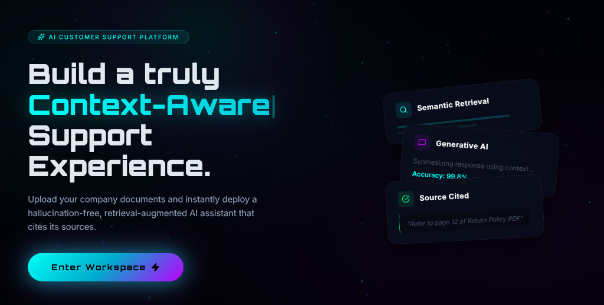
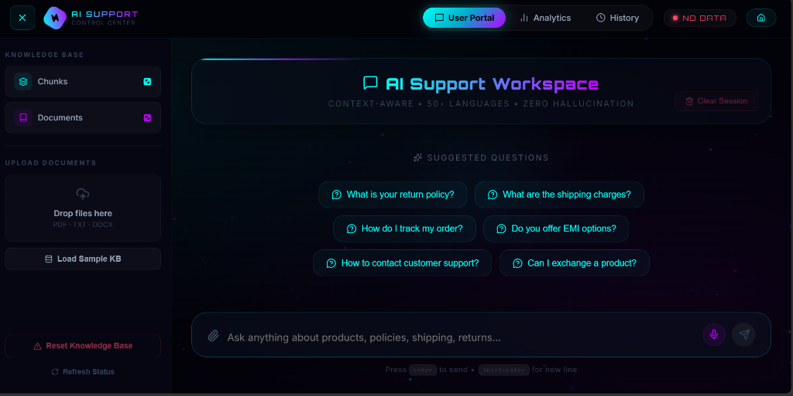
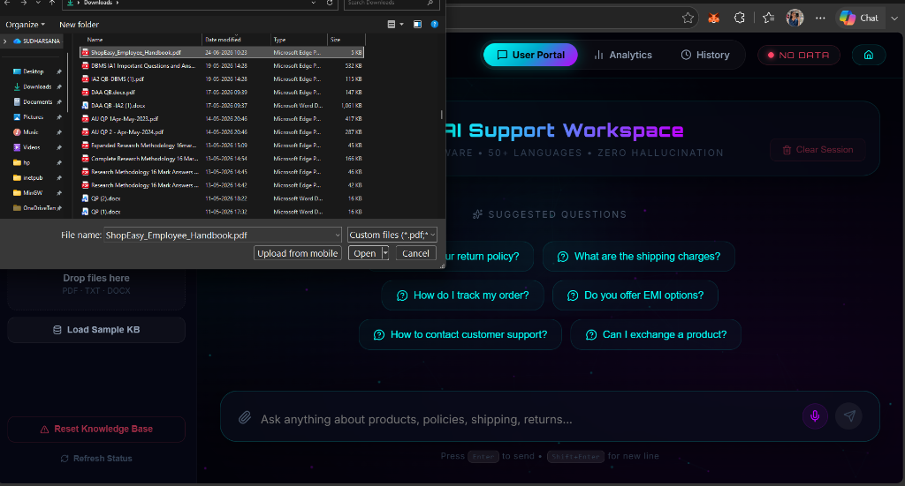
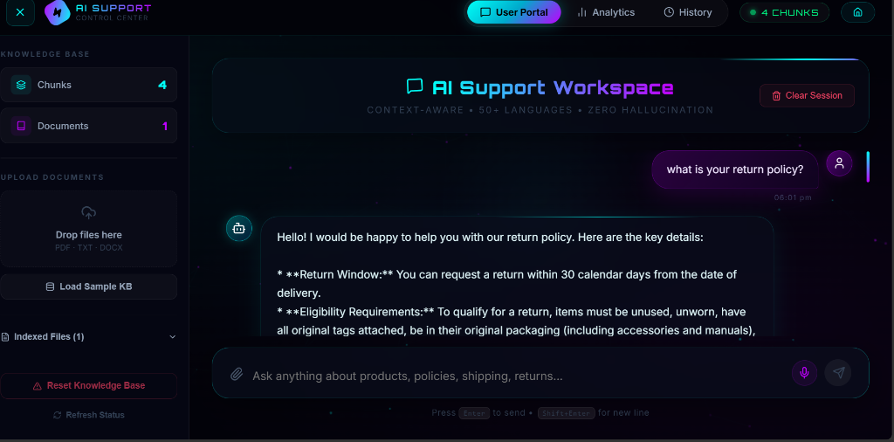
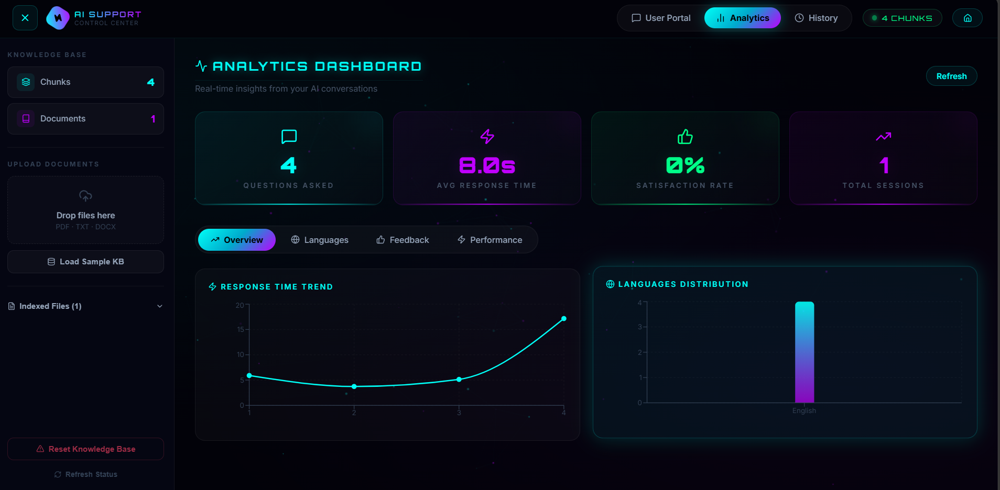
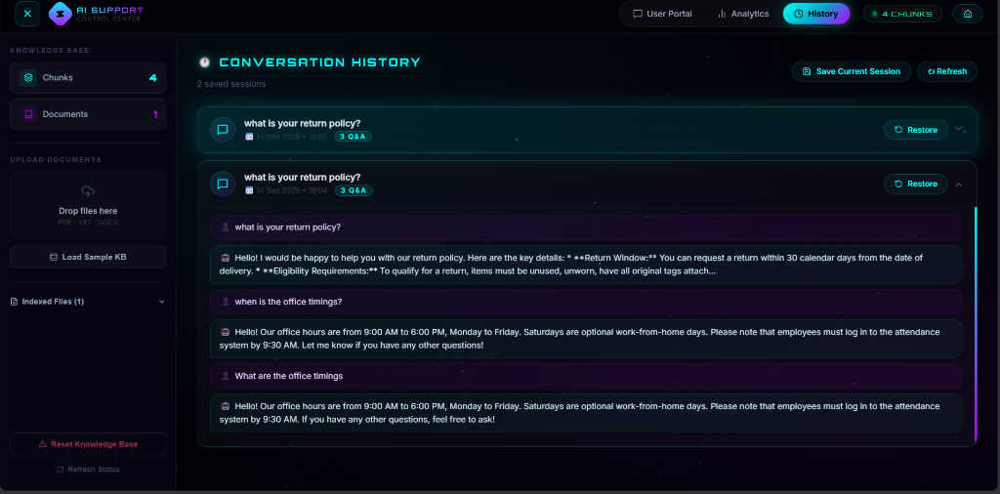

# Intelligent RAG Customer Support Chatbot

A modern **AI-powered customer support platform** built using **Retrieval-Augmented Generation (RAG)** and the **Google Gemini API**.

The system allows users to upload company documents and ask questions based on their own knowledge base. Relevant document content is retrieved using semantic search and provided to Gemini to generate context-aware responses.

---

# Features

- 📄 Upload PDF, DOCX, and TXT documents
- 🧠 Retrieval-Augmented Generation (RAG)
- 🤖 Google Gemini API integration
- 🔍 Semantic search with ChromaDB
- 💬 Context-aware customer support chat
- 🌐 Multilingual support
- 📊 Analytics dashboard
- 🕘 Conversation history and session restore
- 📚 Knowledge base management
- 🎨 Modern React-based interface
- ⚡ Flask REST API backend

---

## Application Screenshots

### Landing Page

Modern landing page introducing the AI-powered customer support platform.



---

### AI Support Workspace

The main workspace provides suggested questions, document management, and an interactive chatbot interface.



---

### Document Upload

Users can upload company documents such as **PDF, DOCX, and TXT** files to build the knowledge base.



---

### RAG Chat Response

The chatbot retrieves relevant information from uploaded documents and uses **Google Gemini** to generate context-aware responses.



---

### Analytics Dashboard

The analytics dashboard provides insights into chatbot usage, response time, sessions, and language distribution.



---

### Conversation History

Previous conversations can be saved, viewed, and restored from the history dashboard.



---

## How RAG Works

```text
User Question
      ↓
Query Processing
      ↓
Embedding Generation
      ↓
Semantic Search
      ↓
ChromaDB Vector Database
      ↓
Relevant Document Chunks
      ↓
Context + User Question
      ↓
Google Gemini API
      ↓
Context-Aware Response
```

---

## Tech Stack

| Technology | Purpose |
|---|---|
| React | Frontend UI |
| Vite | Frontend Development |
| Python | Backend & AI Logic |
| Flask | REST API |
| Google Gemini API | LLM Response Generation |
| ChromaDB | Vector Database |
| Sentence Transformers | Embeddings |
| RAG | Knowledge Retrieval |
| PyPDF | PDF Processing |
| python-docx | DOCX Processing |
| Framer Motion | UI Animations |
| Recharts | Analytics Visualization |

---

## 📁 Project Structure

```text
Intelligent-RAG-Chatbot/
│
├── data/
│   └── company_docs/
│
├── docs/
│   └── screenshots/
│       ├── 01_landing_page.png
│       ├── 02_workspace_suggestions.png
│       ├── 03_document_upload.png
│       ├── 04_rag_chat_response.png
│       ├── Analytics Dashboard .png
│       └── 06_conversation_history.png
│
├── frontend/
│
├── src/
│   ├── multilingual.py
│   └── rag_pipeline.py
│
├── tests/
│
├── api.py
├── app.py
├── requirements.txt
├── .gitignore
└── README.md
```

---

## Installation

### 1. Clone the Repository

```bash
git clone https://github.com/Sudharsana125/Intelligent-RAG-Chatbot.git
cd Intelligent-RAG-Chatbot
```

### 2. Create a Virtual Environment

```bash
python -m venv venv
```

Activate it on Windows:

```bash
venv\Scripts\activate
```

### 3. Install Python Dependencies

```bash
pip install -r requirements.txt
```

### 4. Install Frontend Dependencies

```bash
cd frontend
npm install
```

---

## 🔑 Gemini API Configuration

This project uses the **Google Gemini API** for AI response generation.

Create a `.env` file in the root directory:

```env
GEMINI_API_KEY=your_gemini_api_key_here
```
---

## ▶️ Run the Project

Start the Flask backend:

```bash
python api.py
```

Then start the React frontend:

```bash
cd frontend
npm run dev
```

Open the local URL displayed by Vite in your browser.

---

## 💡 How It Works

1. Upload a company document.
2. The document is extracted and divided into smaller chunks.
3. Embeddings are generated for the document chunks.
4. Embeddings are stored in **ChromaDB**.
5. The user asks a question.
6. Semantic search retrieves the most relevant document chunks.
7. The retrieved context is passed to the **Google Gemini API**.
8. Gemini generates a context-aware answer.
9. Conversations can be saved and restored through the history page.
10. Usage information can be viewed through the analytics dashboard.

---

## Example Questions

```text
What is your return policy?

What are the shipping charges?

How do I track my order?

Do you offer EMI options?

How can I contact customer support?

Can I exchange a product?
```

---

## 📊 Analytics Dashboard

The application includes an analytics dashboard for monitoring:

- Questions asked
- Average response time
- Satisfaction rate
- Total sessions
- Response time trends
- Language distribution

---

## Conversation History

Conversation history allows users to:

- Save current sessions
- View previous conversations
- Expand saved conversations
- Restore previous sessions
- Continue earlier interactions

---

## Project Goal

The goal of this project is to build a practical **AI customer support system** that combines **RAG, Generative AI, semantic search, document processing, conversation history, and analytics** in a single application.

Instead of relying only on the LLM's general knowledge, the chatbot retrieves information from uploaded company documents before generating its response.

---

## 🔐 Security

API keys should never be committed directly to the repository.

Use environment variables:

```env
GEMINI_API_KEY=your_api_key
```

and keep the `.env` file excluded through `.gitignore`.

---

## 👨‍💻 Author

**Sudharsana**

AI & Data Science Project

**Intelligent RAG Customer Support Chatbot**

Built with **Google Gemini + RAG + ChromaDB + React + Flask**

Built to provide reliable, document-grounded customer support using RAG.
---
